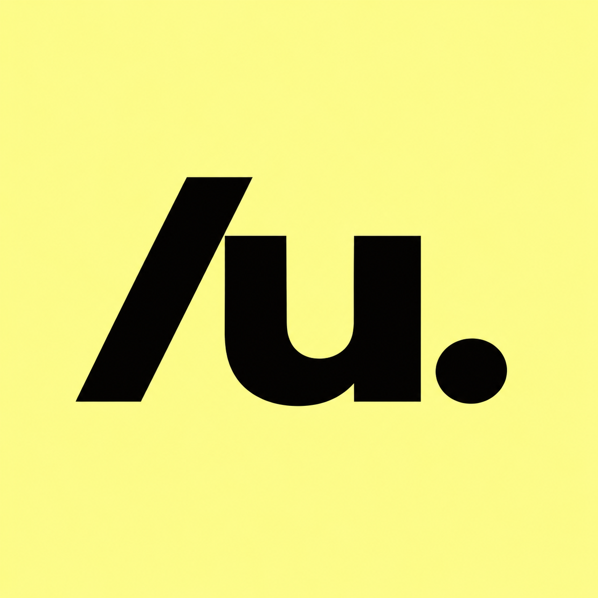

# unveo

**Turn your hackathon repo into a judge-ready demo video, before the deadline.**

unveo is a free skill for coding agents (Claude Code, Codex, opencode, Cursor and more). It reads your code, records your real app in an automated browser, animates the logic judges can't see, adds a voiceover, and renders a 1080p MP4 that fits your submission limit.

> Status: in design. These docs describe v0.1.0. Nothing is installable yet.

<!-- GIF: 10-second preview of a video made by unveo -->

## What you get

- **Your real product, clicked through.** unveo finds your deployed app, works out the main user journey and records it, with a visible cursor, paced to the narration.
- **The hidden logic, explained.** Risk scores, model predictions, data pipelines: animated the way your code actually does them, with sample numbers clearly labelled.
- **A pitch judges follow.** Context → problem → product → impact, sized to 60 s, 90 s, 2 min or 3 min.
- **A voiceover in English or Hindi.** Free, with no API key.
- **Done for you, checked for you.** Duration, loudness, glitches, links and sources are all checked before you get the file.

Completely free: no API keys, no accounts, no credits.

## Install

Pick your agent. `Unveo` will be the final GitHub owner.

**Claude Code**
```
/plugin marketplace add Unveo/unveo
/plugin install unveo@unveo
```

**Codex CLI**
```
codex plugin marketplace add Unveo/unveo
codex plugin add unveo@unveo
```

**opencode, Cursor, Copilot, Gemini CLI and others**
```
npx skills add Unveo/unveo --skill unveo -g
```

**Manual**
```
git clone https://github.com/Unveo/unveo
cp -r unveo/skills/unveo ~/.claude/skills/unveo    # or your agent's skills folder
```

You also need **Python 3.10+**. On the first run, unveo installs everything else it needs (about 400 MB, one time): Playwright with Chromium, ffmpeg and a free voice engine, all in its own folder at `~/.unveo/`.

## Use

Inside your project:
```
/unveo
```
Or point it at any repo:
```
/unveo https://github.com/your-team/your-project
```
In Codex use `$unveo`; in other agents just ask: *"use unveo to make our hackathon demo video"*.

**What happens**
1. **Setup check:** installs anything missing.
2. **One question round:** Quick or Guided, the length, the language, and whether an AI voice or *you* narrate. Quick mode takes the recommended answer for everything else.
3. **You approve the script** and the recording plan (and, in Quick mode, unveo's summary of your project).
4. **Your own voice (optional):** a teleprompter page with the unveo logo. A yellow highlighter follows the word you're saying, and an underline shows the pace. It's recorded before the screen, so the video follows your voice.
5. **unveo records your app.** If it needs a login, the browser shows a dotted arrow to what you click, and then the yellow "Recording…" screens. None of that ends up in the video.
6. **You approve the stills**, in a look this video gets (6 looks; never the same one twice in a row).
7. **`unveo-out/demo-video.mp4`**, ready to upload.

Options: `--quick` · `--own-voice` · `--limit 90` · `--lang hi` · `--url https://your.app` · `--no-capture` · `resume` · `rerender s06` · `check`.

## What's in `unveo-out/`

| File | What it is |
|---|---|
| `demo-video.mp4` | Your video: 1920×1080, 30 fps, captions burned in, under your limit |
| `subtitles.srt` | The captions as a file, for YouTube or Devpost |
| `script.md` | The narration with times, easy to read |
| `quality-check.md` | The quality report |
| `preview.png` | The stills you approved |
| `your-voice/` | Your takes, if you narrated |
| `your-clips/` | Only if some parts need you to record them, with `what-to-record.md` |

Everything else unveo needs (answers, recordings, renders) is in the hidden `.work/` folder. The folder ignores itself in git.

## FAQ

**My app isn't deployed.** Start it locally and give unveo the `localhost` URL, or pass `--no-capture` and record the clips yourself from the shot list.

**My app needs a login.** Use a demo account. Set `UNVEO_LOGIN_USER` and `UNVEO_LOGIN_PASSWORD` in your terminal. unveo never stores them or shows them on screen.

**Will it click something dangerous?** Deletes, payments, emails and similar actions are flagged for your approval and skipped by default. Payments are never automated.

**It's a mobile, CLI or hardware project.** unveo writes a shot list and teleprompter for you to record those parts, and still makes all the animations, the voiceover and the edit.

**How long does the render take?** A few minutes for a 2-minute video on a recent laptop. unveo tells you its estimate before it starts.

**Windows?** Yes. If cloning the repo, run `git config --global core.symlinks true` first, or just use `npx skills add`.

## Credits and licence

MIT. The rendering engine is adapted from [howseen-ai/claude-motion-design](https://github.com/howseen-ai/claude-motion-design) (MIT). Packaging follows [latent-spaces/brag](https://github.com/latent-spaces/brag). Voices: [edge-tts](https://github.com/rany2/edge-tts) (default; it uses Microsoft's Edge Read Aloud service, whose terms for reusing audio aren't published) and [Kokoro](https://huggingface.co/hexgrad/Kokoro-82M) (Apache-2.0, offline: use `--provider kokoro` for a fully open voice).

Docs and design specs: [docs/00-INDEX.md](docs/00-INDEX.md).
